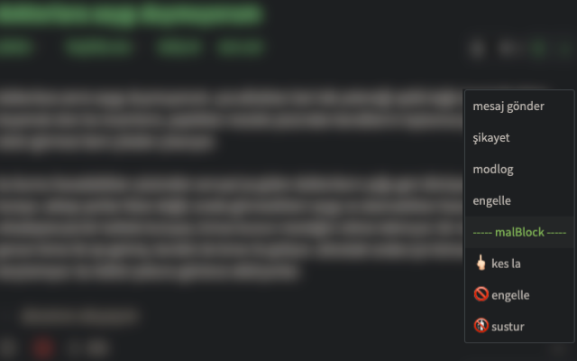

#  malBlock chrome extension

malBlock chrome extension for eksisozluk.com to extend feedback & user actions menu with direct block & mute actions.

## permission justification

- `activeTab`: will be used to inject script & manipulate dom content of eksisozluk.com
- `scripting`: will be used to inject script & manipulate dom content of eksisozluk.com
- `tabs`: will be used to inject script & manipulate dom content of eksisozluk.com
- `host_permissions`: will be used to invoke existing page script within the content of eksisozluk.com
